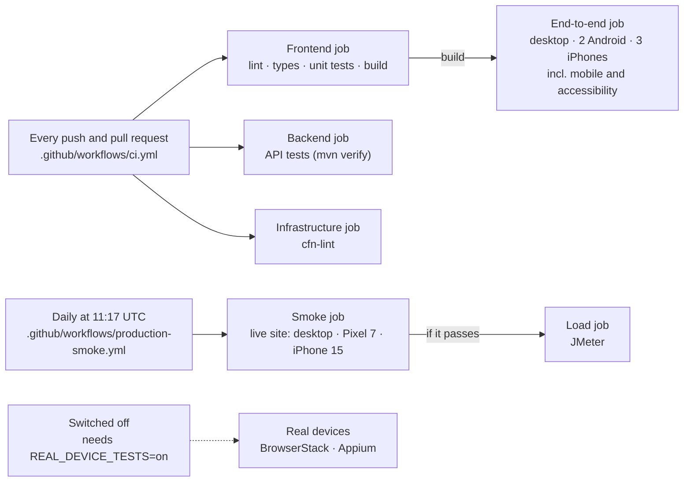
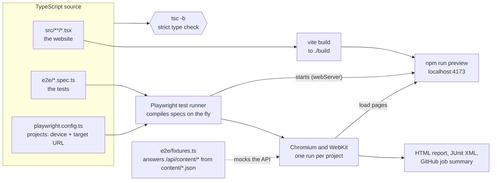
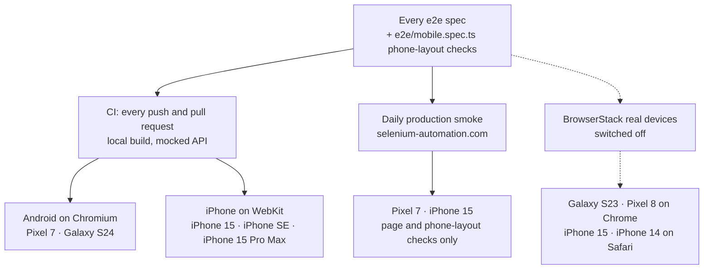
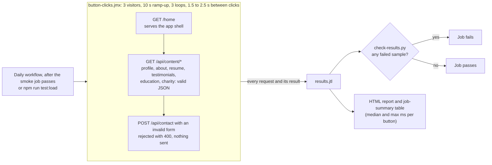

# Testing

How selenium-automation.com is tested, one type of test per section. Each section says what the
tests cover, where they live, when they run and how to run them.

## At a glance

| # | Type | Tool | Where it lives | Runs | Command |
|---|---|---|---|---|---|
| 1 | [Unit and component](#1-unit-and-component-tests) | Vitest, Testing Library | `src/**/*.test.ts(x)` | Every push and PR | `npm test` |
| 2 | [API](#2-api-tests) | JUnit 5, MockMvc, Mockito | `backend/src/test/` | Every push and PR | `cd backend && mvn verify` |
| 3 | [End-to-end](#3-end-to-end-tests) | Playwright, TypeScript | `e2e/*.spec.ts` | Every push and PR | `npm run test:e2e` |
| 4 | [Mobile](#4-mobile-tests-android-and-ios) | Playwright phone emulation | `e2e/mobile.spec.ts` + every e2e spec | Every push and PR; daily on the live site | `npm run test:mobile` |
| 5 | [Accessibility](#5-accessibility-tests) | axe-core via Playwright | `e2e/accessibility.spec.ts` | Every push and PR | `npm run test:e2e` |
| 6 | [Production smoke](#6-production-smoke-tests) | Playwright, Postman | `e2e/production*.spec.ts`, `postman/` | Daily | `npm run test:smoke` |
| 7 | [Load](#7-load-tests) | JMeter | `jmeter/` | Daily, after the smoke tests | `npm run test:load` |
| 8 | [Infrastructure](#8-infrastructure-checks) | cfn-lint | `infra/template.yaml` | Every push and PR | `cfn-lint infra/template.yaml` |
| 9 | [Real devices](#9-real-devices-switched-off) | BrowserStack, Appium | `browserstack.yml`, `appium/` | **Switched off** | See [browserstack.md](browserstack.md) |

## When tests run



The four push-and-PR jobs are required checks on `master`: a pull request can't merge until they
pass. Every Playwright run uploads its HTML report as a build artifact, and failures appear in the
job log and the job summary.

Before the browser tests, run `npm ci` and, for local runs, `npm run build`. The end-to-end,
mobile and accessibility tests run against the production build served by `npm run preview`.

---

## 1. Unit and component tests

**Vitest and Testing Library.** They render React components in a simulated browser (jsdom) and
check what a user would see.

- **Covers:** routing, one `h1` per page, image alt text, nav labels, the contact form's states,
  resume rendering, the content files, and the hook that loads page content.
- **Lives in:** `src/**/*.test.ts(x)`; shared setup in `src/test/setup.ts`.
- **Runs:** CI Frontend job, on every push and PR.

```bash
npm test             # once
npm run test:watch   # re-runs on save
```

## 2. API tests

**JUnit 5, MockMvc and Mockito** for the Spring Boot backend.

- **Covers:** contact-form validation and error responses, the honeypot spam trap, saving a
  message before emailing it (so a failed email never loses one), the content API, the AWS
  adapters, and that the whole Spring context starts.
- **Lives in:** `backend/src/test/java/`.
- **Runs:** CI Backend job, on every push and PR.

```bash
cd backend && mvn verify
```

## 3. End-to-end tests

**Playwright, written in strict TypeScript.** They drive a real browser through the production
build. The content API is answered from `content/*.json` by `e2e/fixtures.ts`, and the contact API
is mocked, so no email is sent.

- **Covers:** navigation and active links, deep links, unknown paths redirecting home, no console
  errors, the resume accordion, carousels, content loading and fallback, and the contact form with
  a mocked API.
- **Lives in:** `e2e/*.spec.ts`; route list in `e2e/pages.ts`; settings in `playwright.config.ts`.
- **Runs:** CI End-to-end job, on every push and PR, on desktop Chrome and all five phones.

`tsc` checks the types of the site and the tests without producing output, so a type error fails
the build before any browser starts. Vite compiles the site, and Playwright compiles the specs
itself when it runs them.



```bash
npm run build
npm run test:e2e                     # desktop and all phones
npx playwright test --project=desktop
npx playwright show-report           # open the last HTML report
```

## 4. Mobile tests (Android and iOS)

**Playwright phone emulation.** Every end-to-end spec also runs on emulated phones, and
`e2e/mobile.spec.ts` adds phone-only checks that skip themselves on wider screens.



| | Android | iOS |
|---|---|---|
| Emulated, every push and PR | On Chromium: `mobile` (Pixel 7, 412px wide), `mobile-small` (Galaxy S24, 360px) | On WebKit, the engine behind Safari: `mobile-safari` (iPhone 15, 393px), `mobile-safari-small` (iPhone SE, 375px), `mobile-safari-large` (iPhone 15 Pro Max, 430px) |
| Live site, daily | `production-mobile`: Pixel 7 | `production-mobile-safari`: iPhone 15 |
| Real devices, switched off | Samsung Galaxy S23 (Android 13), Google Pixel 8 (Android 14), Chrome | iPhone 15 (iOS 17), iPhone 14 (iOS 16), Safari |

The emulated phones use each device's screen size, pixel density, touch input and user agent.
They run in the desktop builds of Chromium and WebKit, so they catch layout and touch problems,
not bugs that only appear in the phone's own browser. [Real devices](#9-real-devices-switched-off)
would cover those.

The phone-only checks (`phone layout` in `e2e/mobile.spec.ts`):

- The nav fits on one row of icon buttons, each at least 44px, the minimum tap size in Apple's guidelines.
- Tapping each nav button opens its page.
- No page scrolls sideways.
- Home page buttons are large enough to tap.
- The contact form's E-mail field brings up the email keyboard, Name and E-mail offer autofill,
  and no field zooms the page on focus (font size of at least 16px, which stops iOS Safari from zooming).
- Resume roles expand with a tap and stay on screen.

```bash
npm run build && npm run test:mobile          # all five emulated phones
npx playwright test --project='mobile-safari*' # iPhones only
npx playwright test --project='mobile' --project='mobile-small'   # Android only
```

## 5. Accessibility tests

**axe-core, run through Playwright** on every page.

- **Covers:** WCAG 2.1 A and AA rules. A test fails on any serious or critical violation.
- **Lives in:** `e2e/accessibility.spec.ts`.
- **Runs:** with the end-to-end tests, on desktop and every phone.

```bash
npx playwright test e2e/accessibility.spec.ts
```

## 6. Production smoke tests

**Playwright and Postman, against the live site.** All read-only: nothing submits the contact
form or sends an email.

- **Playwright covers:** every page is up; HTTPS and security headers; API health; the contact API
  rejecting invalid input; each content API responding with edge caching; the resume rendering
  from the live API; and unknown API paths returning 404.
  `e2e/production-buttons.spec.ts` clicks every nav button and checks the request behind it.
- **Phones:** the Pixel 7 and iPhone 15 run the page and phone-layout checks only. The API-only
  checks stay on desktop, so the API's limit of 2 requests per second isn't hit three times over.
- **Postman** (`postman/AboutShane-API.postman_collection.json`): health, invalid input, malformed
  JSON and unknown-path checks for the API. Run it by hand in Postman or Newman; it isn't in CI.
- **Runs:** daily workflow, and after each deploy.

```bash
npm run test:smoke
```

## 7. Load tests

**JMeter**, sending the request behind every button on the live site, as a few visitors clicking
through it at once.

- **Covers:** the home page, each nav button's content API, and the contact form's Send with an
  invalid form (rejected, nothing sent). It records median and max response time per button.
- **Lives in:** `jmeter/button-clicks.jmx`; pass/fail in `jmeter/check-results.py`.
- **Runs:** daily workflow, only if the smoke tests passed.



The defaults keep it under the API's limit of 2 requests per second. Change them with JMeter
properties, for example `jmeter -n -t jmeter/button-clicks.jmx -Jusers=5 -Jloops=10`; more users
can hit that limit.

```bash
brew install jmeter
npm run test:load    # report in jmeter/results/report/index.html
```

## 8. Infrastructure checks

**cfn-lint** validates the AWS SAM template: resource types, properties and references.

- **Lives in:** `infra/template.yaml`.
- **Runs:** CI Infrastructure job, on every push and PR.

```bash
pip install cfn-lint
cfn-lint infra/template.yaml
```

## 9. Real devices (switched off)

Testing on real phones is prepared but **not in use**. There are two routes: the Playwright suite
on BrowserStack, and an Appium config (`appium/`) that drives the phone's own Chrome or Safari.
Both are blocked unless `REAL_DEVICE_TESTS=on` is set, so neither can start by accident.
[browserstack.md](browserstack.md) explains both and how to switch them on.
